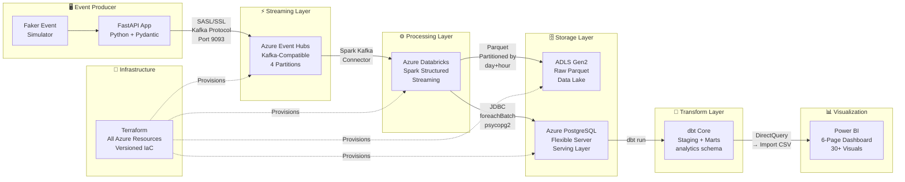
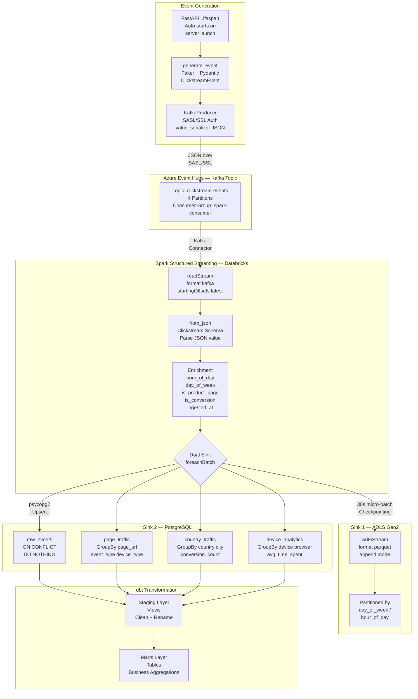
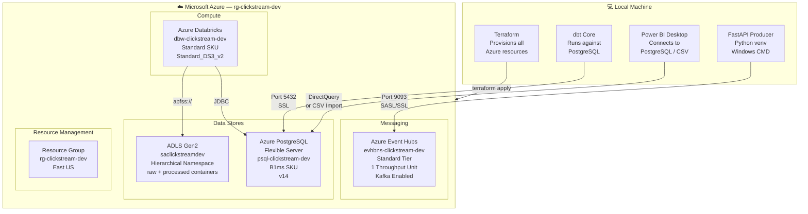
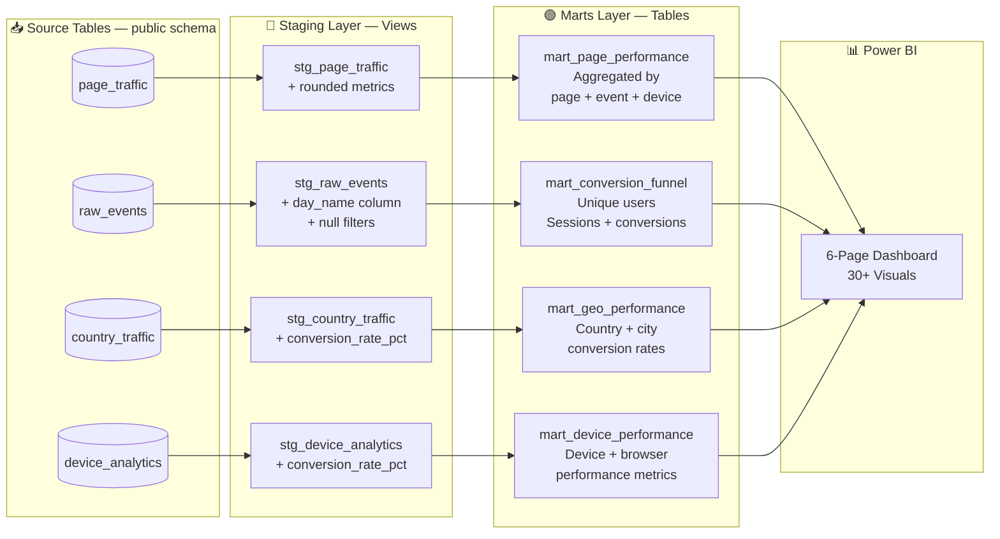

# 🌊 Real-Time Clickstream Analytics Pipeline

> A production-grade, end-to-end real-time data engineering pipeline built on Azure — simulating, streaming, processing, transforming, and visualizing millions of website clickstream events using industry-standard tools.


---

## 📋 Table of Contents

- [Project Overview](#-project-overview)
- [Architecture](#-architecture)
- [Tech Stack & Decisions](#-tech-stack--architectural-decisions)
- [Pipeline Walkthrough](#-pipeline-walkthrough)
- [Project Structure](#-project-structure)
- [Infrastructure as Code](#-infrastructure-as-code-terraform)
- [Data Schema](#-data-schema)
- [dbt Transformation Layer](#-dbt-transformation-layer)
- [Dashboard](#-power-bi-dashboard)
- [Getting Started](#-getting-started)
- [Key Engineering Decisions](#-key-engineering-decisions)
- [Lessons Learned](#-lessons-learned)

---

## 🎯 Project Overview

This project simulates a real-world **e-commerce clickstream analytics platform** — the kind of system used by companies like Amazon, Netflix, and Shopify to understand how users interact with their websites in real time.

### What it does

- **Simulates** realistic website clickstream events (page views, clicks, scrolls, add-to-cart, purchases) using a FastAPI producer with the Faker library
- **Streams** events in real time to Apache Kafka via Azure Event Hubs at up to 5 events/second continuously
- **Processes** the stream using Spark Structured Streaming on Azure Databricks — parsing, enriching, and transforming raw JSON events
- **Stores** raw events as Parquet files in an Azure Data Lake Storage Gen2 (raw layer) and aggregated metrics in Azure PostgreSQL (serving layer)
- **Transforms** the serving layer using dbt Core — building a clean staging and marts layer following the medallion architecture
- **Visualizes** analytics across a 6-page Power BI dashboard with 30+ visuals covering traffic, conversions, geography, devices, and product performance
- **Provisions** all cloud infrastructure using Terraform — every resource is code, versioned, and repeatable

## 🏗️ Architecture

### High-Level Architecture Diagram



---

### Detailed Data Flow Diagram



---

### Infrastructure Architecture (Azure)



---

### dbt Lineage Graph



---

## 🛠️ Tech Stack & Architectural Decisions

### Why Apache Kafka (via Azure Event Hubs)?

**Apache Kafka** is the industry standard for real-time event streaming, appearing in the majority of data engineering job descriptions. The decision to use **Azure Event Hubs with Kafka protocol compatibility** was deliberate and strategic:

- Azure Event Hubs exposes a **Kafka-compatible API on port 9093** — meaning all Kafka client libraries work unchanged
- This gives the best of both worlds: **Kafka on the resume** (the open-source skill employers want) **+ Azure Event Hubs on the resume** (the managed cloud service enterprises use)
- In production, teams often migrate from self-managed Kafka to Event Hubs to eliminate operational overhead — understanding both is a senior-level skill
- **4 partitions** were configured to allow parallel consumption by Spark and future horizontal scaling
- **SASL/SSL authentication** with connection string credentials mirrors production security practices

### Why Apache Spark + Azure Databricks?

**Apache Spark** is the de-facto standard for large-scale data processing. **Databricks** is the commercial platform built around Spark and is the fastest-growing tool in enterprise data engineering.

- **Spark Structured Streaming** was chosen over Spark Streaming (DStream API) because it provides a unified batch/streaming API, better fault tolerance via checkpointing, and watermarking for late data handling
- **Azure Databricks** provides managed Spark clusters, eliminating the need to manage YARN, JVM dependencies, or cluster configuration
- The **`foreachBatch`** sink pattern was chosen over native Spark JDBC because it allows custom upsert logic (`ON CONFLICT DO NOTHING`) — critical for exactly-once semantics in a streaming pipeline
- **30-second micro-batch trigger** balances latency vs. throughput — low enough for near-real-time analytics, high enough to batch PostgreSQL writes efficiently
- **Checkpointing to ADLS** ensures the pipeline can recover from failures without reprocessing or data loss

### Why Dual Sink (ADLS Gen2 + PostgreSQL)?

This follows the **Lakehouse architecture pattern** — storing both raw and processed data:

- **ADLS Gen2 (Raw Layer):** Stores every raw event as Parquet files partitioned by `day_of_week` and `hour_of_day`. This is the immutable source of truth. If transformation logic changes, data can be reprocessed from here. Parquet was chosen over JSON/CSV for columnar compression and efficient predicate pushdown
- **PostgreSQL (Serving Layer):** Stores pre-aggregated metrics for low-latency dashboard queries. A full-scan of Parquet files for every Power BI refresh would be slow and expensive — PostgreSQL gives sub-second query times on aggregated data
- This separation of raw vs. serving layers is the foundation of the **Medallion Architecture** (Bronze → Silver → Gold)

### Why dbt Core?

**dbt (data build tool)** is the most in-demand transformation tool in modern data engineering. It brings software engineering best practices to SQL:

- **Version-controlled SQL** — all transformations are `.sql` files in Git
- **Staging → Marts layering** separates concerns: staging cleans raw data, marts serve business logic
- **Materialization strategy:** Staging models are `views` (no storage cost, always fresh) while mart models are `tables` (fast query performance for Power BI)
- **`ref()` function** builds an explicit DAG of dependencies — dbt handles execution order automatically
- **Schema tests** (`unique`, `not_null`) catch data quality issues before they reach the dashboard
- **Auto-generated documentation** with lineage graphs demonstrates pipeline transparency

### Why Terraform?

**Terraform** treats infrastructure as code — every Azure resource is defined, versioned, and reproducible:

- **Reproducibility:** The entire Azure environment can be recreated in 10 minutes with `terraform apply`
- **Cost control:** `terraform destroy` tears down everything cleanly, stopping all billing
- **Auditability:** Infrastructure changes are tracked in Git like application code
- **Provider ecosystem:** The `azurerm` and `databricks` Terraform providers cover every resource in this project
- **Sensitive variables:** PostgreSQL passwords and connection strings are passed via `terraform.tfvars` (gitignored) and Databricks secret scopes — never hardcoded

### Why FastAPI?

**FastAPI** was chosen as the event producer framework because:

- **Async-native:** Built on Starlette/asyncio, making it ideal for background streaming tasks
- **Pydantic integration:** The `ClickstreamEvent` Pydantic model enforces a strict schema at the producer level — if an event doesn't conform to the schema, it fails before hitting Kafka
- **Auto-generated Swagger UI:** Every endpoint is self-documenting and testable at `/docs`
- **Lifespan events:** The `@asynccontextmanager lifespan` pattern starts the continuous event stream automatically when the server launches — no manual trigger needed

### Why Power BI?

Power BI was chosen over Grafana, Metabase, or Superset because:

- It is the **most in-demand BI tool** across enterprise data engineering and analytics roles
- Native integration with the Microsoft/Azure ecosystem
- **DirectQuery mode** (live database) and **Import mode** (CSV snapshots) both supported
- Rich support for **DAX measures** — calculated metrics that go beyond simple SQL aggregations

---

## 🔄 Pipeline Walkthrough

### 1. Event Generation
The FastAPI app starts a background async task on server launch that generates and publishes clickstream events continuously at **5 events/second**. Each event is a `ClickstreamEvent` Pydantic model containing fields like `user_id`, `session_id`, `page_url`, `event_type`, `device_type`, `country`, `city`, `product_category`, and `time_spent_seconds`.

### 2. Kafka Publishing
The `KafkaProducer` connects to Azure Event Hubs using the Kafka protocol over **SASL/SSL on port 9093**. Events are serialized to JSON and published to the `clickstream-events` topic. The initial `ConnectionResetError` on startup is expected behavior from Azure Event Hubs during the API version negotiation handshake — the producer recovers automatically.

### 3. Spark Structured Streaming
A Databricks notebook reads from the Kafka topic using the `kafkashaded` JAAS config (Databricks uses a shaded Kafka package). Raw Kafka messages arrive as binary — the `value` column is cast to string and parsed with `from_json()` against the defined schema. Events are enriched with derived columns (`hour_of_day`, `day_of_week`, `is_product_page`, `is_conversion`) and a processing timestamp.

### 4. Dual Sink
Every 30 seconds, a micro-batch is processed:
- **ADLS sink** writes Parquet files partitioned by day and hour with checkpointing for fault tolerance
- **PostgreSQL sink** uses `psycopg2` with `ON CONFLICT (event_id) DO NOTHING` for idempotent upserts — Spark's native JDBC `.mode("append")` was rejected because it fails on duplicate primary keys during batch retries

### 5. dbt Transformation
dbt runs against the `public` schema in PostgreSQL and materializes models into the `analytics` schema. Staging models clean and enrich raw tables. Mart models aggregate staging models into business-friendly tables optimized for Power BI queries.

### 6. Power BI Dashboard
Power BI connects to the `analytics` schema and visualizes 4 mart tables across 6 dashboard pages covering traffic, conversions, geography, devices, product performance, and user behaviour.

---

## 📁 Project Structure

```
realtime-clickstream-pipeline/
│
├── producer/                          # FastAPI Event Producer
│   ├── main.py                        # FastAPI app with lifespan streaming
│   ├── event_schema.py                # Pydantic ClickstreamEvent model
│   ├── kafka_producer.py              # KafkaProducer with SASL/SSL
│   ├── simulator.py                   # Faker-based event generator
│   ├── config.py                      # dotenv config loader
│   └── requirements.txt
│
├── spark_processor/                   # Databricks Notebooks
│   └── clickstream_pipeline.py        # Combined 5-cell pipeline notebook
│
├── dbt_transforms/                    # dbt Project
│   └── clickstream_dbt/
│       ├── models/
│       │   ├── staging/               # Cleaning layer (views)
│       │   │   ├── stg_raw_events.sql
│       │   │   ├── stg_page_traffic.sql
│       │   │   ├── stg_country_traffic.sql
│       │   │   └── stg_device_analytics.sql
│       │   └── marts/                 # Business layer (tables)
│       │       ├── mart_page_performance.sql
│       │       ├── mart_conversion_funnel.sql
│       │       ├── mart_geo_performance.sql
│       │       └── mart_device_performance.sql
│       ├── schema.yml                 # Model documentation + tests
│       └── dbt_project.yml
│
├── power_bi/                          # Power BI Assets
│   ├── clickstream_dashboard.pbix     # Power BI Dashboard file
│   └── data_exports/                  # CSV exports for offline development
│       ├── mart_page_performance.csv
│       ├── mart_conversion_funnel.csv
│       ├── mart_geo_performance.csv
│       └── mart_device_performance.csv
│
├── terraform/                             # Terraform IaC
│   ├── main.tf                        # All Azure resources
│   ├── variables.tf                   # Input variable definitions
│   ├── outputs.tf                     # Output values
│   └── terraform.tfvars               # ⚠️ gitignored — contains secrets
│
├── data_lake/                         # Local placeholder for ADLS
├── export_data.py                     # PostgreSQL → CSV export script
├── .env                               # ⚠️ gitignored — contains secrets
├── .gitignore
└── README.md
```

---

## 🔧 Infrastructure as Code (Terraform)

All Azure resources are provisioned using Terraform. The infrastructure includes:

| Resource | Azure Service | Purpose |
|---|---|---|
| Resource Group | `rg-clickstream-dev` | Container for all resources |
| Event Hubs Namespace | Standard SKU, Kafka enabled | Kafka-compatible message broker |
| Event Hub | 4 partitions, 1 day retention | Clickstream events topic |
| Consumer Group | `spark-consumer` | Dedicated Spark reader group |
| Storage Account | ADLS Gen2, HNS enabled | Raw Parquet data lake |
| Storage Containers | `raw`, `processed` | Lake layer separation |
| PostgreSQL Flexible Server | B1ms, v14, SSL required | Serving layer database |
| PostgreSQL Database | `clickstream_db` | Application database |
| Databricks Workspace | Standard SKU | Managed Spark platform |

```bash
# Provision everything
terraform init
terraform plan
terraform apply

# Tear down everything (stops all billing)
terraform destroy
```

---

## 📊 Data Schema

### ClickstreamEvent (Producer Schema)

| Field | Type | Description |
|---|---|---|
| `event_id` | UUID | Unique event identifier (Primary Key) |
| `user_id` | UUID | Anonymized user identifier |
| `session_id` | UUID | Browser session identifier |
| `timestamp` | ISO8601 | Event timestamp (UTC) |
| `page_url` | string | Page visited (e.g. `/products/shoes`) |
| `referrer_url` | string | Previous page URL |
| `event_type` | enum | `page_view`, `click`, `scroll`, `add_to_cart`, `purchase` |
| `device_type` | enum | `desktop`, `mobile`, `tablet` |
| `browser` | string | `Chrome`, `Firefox`, `Safari`, `Edge` |
| `country` | string | User country |
| `city` | string | User city |
| `product_id` | UUID | Product ID (product pages only) |
| `product_category` | string | `shoes`, `shirts`, `pants`, `jackets`, `accessories` |
| `time_spent_seconds` | int | Time spent on page (3–300s) |

### PostgreSQL Tables (Serving Layer)

**`public.raw_events`** — Every individual event, deduplicated by `event_id`

**`public.page_traffic`** — Per-batch aggregation of events by `page_url`, `event_type`, `device_type`

**`public.country_traffic`** — Per-batch aggregation by `country`, `city` with conversion counts

**`public.device_analytics`** — Per-batch aggregation by `device_type`, `browser` with avg time spent

### dbt Analytics Schema

**`analytics.mart_page_performance`** — Total events, avg time spent per page/event/device combination

**`analytics.mart_conversion_funnel`** — Unique users, sessions, conversion rates per page and event type

**`analytics.mart_geo_performance`** — Country and city level traffic and conversion rate metrics

**`analytics.mart_device_performance`** — Device type and browser performance with conversion rates

---

## 🔄 dbt Transformation Layer

### Materialization Strategy

| Layer | Materialization | Reason |
|---|---|---|
| Staging | `view` | No storage cost, always reflects latest raw data, lightweight |
| Marts | `table` | Pre-computed for fast Power BI query performance |

### Data Quality Tests

```yaml
# schema.yml — dbt tests
- name: stg_raw_events
  columns:
    - name: event_id
      tests:
        - unique        # No duplicate events
        - not_null      # Every event has an ID
```

### Running dbt

```bash
# Activate venv
venv\Scripts\activate

# Set environment variables
set POSTGRES_HOST=your-host.postgres.database.azure.com
set POSTGRES_PASSWORD=your-password

# Run all models
dbt run

# Run tests
dbt test

# Generate + serve documentation
dbt docs generate
dbt docs serve
```

---

## 📊 Power BI Dashboard

The dashboard contains **8 pages** with **40+ visuals**:

| Page | Focus | Key Visuals |
|---|---|---|
| 1 — Executive Summary | KPI overview | 6 KPI cards, line chart, donut, treemap |
| 2 — Page Traffic Deep Dive | Page engagement | Clustered bars, stacked bars, matrix heatmap |
| 3 — Conversion Funnel | Purchase journey | Funnel charts, scatter plot, conversion rate bars |
| 4 — Geographic Intelligence | Global traffic | Filled maps, country/city bar charts, scatter |
| 5 — Device & Browser | Platform analysis | Donut charts, clustered bars, matrix heatmap |
| 6 — Product Analytics | E-commerce metrics | Product funnel, category performance, device split |

## 🚀 Getting Started

### Prerequisites

- Python 3.11+
- Docker Desktop
- Azure CLI (`az --version`)
- Terraform (`terraform --version`)
- Git
- Power BI Desktop
- Active Azure subscription

### Setup

```bash
# 1. Clone the repository
git clone https://github.com/murtazaziya/realtime-clickstream-pipeline.git
cd realtime-clickstream-pipeline

# 2. Create and activate virtual environment
python -m venv venv
venv\Scripts\activate

# 3. Install dependencies
pip install -r requirements.txt
pip install dbt-postgres

# 4. Configure environment variables
# Copy .env.example to .env and fill in your values
# (create .env.example from the keys listed below)

# 5. Provision Azure infrastructure
cd infra
terraform init
terraform apply

# 6. Start the producer
cd ../producer
uvicorn main:app --reload --port 800

# 7. Run Databricks notebook
# Open clickstream_pipeline notebook in Databricks UI
# Run all cells top to bottom

# 8. Run dbt transformations
cd ../dbt_transforms/clickstream_dbt
dbt run
dbt test

# 9. Open Power BI dashboard
# Open power_bi/clickstream_dashboard.pbix
```

### Environment Variables

```env
EVENTHUB_CONNECTION_STRING=Endpoint=sb://...
EVENTHUB_NAMESPACE=evhbns-clickstream-dev
EVENTHUB_NAME=clickstream-events
POSTGRES_HOST=psql-clickstream-dev.postgres.database.azure.com
POSTGRES_DB=clickstream_db
POSTGRES_USER=pgadmin
POSTGRES_PASSWORD=your_password
DATABRICKS_WORKSPACE_URL=https://adb-xxx.azuredatabricks.net
```

---

## 🧠 Key Engineering Decisions

### 1. Idempotent PostgreSQL Writes
Spark's native `.mode("append").jdbc()` fails on duplicate primary keys when a micro-batch is retried after a failure. The solution was to use `psycopg2` directly with `INSERT ... ON CONFLICT (event_id) DO NOTHING` — guaranteeing idempotent, exactly-once writes to the raw events table.

### 2. Kafka JAAS Config in Databricks
Databricks ships with a shaded Kafka package, meaning the standard `org.apache.kafka` class path doesn't work. The JAAS config must use `kafkashaded.org.apache.kafka.common.security.plain.PlainLoginModule` — a production detail that only appears when running Spark on Databricks specifically.

### 3. Databricks Secret Scopes (Standard SKU)
The Standard Databricks SKU requires the `--initial-manage-principal users` flag when creating secret scopes. This grants all workspace users management access to the scope — acceptable for a development environment. Production environments would use Premium SKU with fine-grained ACLs.

### 4. Continuous Streaming via FastAPI Lifespan
Rather than requiring a manual API call to start event generation, the `asynccontextmanager lifespan` pattern starts continuous streaming automatically when uvicorn launches. This mirrors how real producers work — they stream constantly, not on-demand.

### 5. DirectQuery → Import Mode Migration
Power BI was originally configured in DirectQuery mode against live PostgreSQL. After `terraform destroy` removed the database, the dashboard was migrated to Import mode using exported CSVs — demonstrating understanding of Power BI's two data connectivity modes and graceful handling of infrastructure teardown.

---

## 🔗 Connect

Built by **Murtaza Ziya** — Data Engineer

[](https://linkedin.com/in/murtaza-ziya)
[](https://github.com/murtazaziya)

---

*This project was built as a portfolio demonstration of real-time data engineering skills. All data is synthetically generated and does not represent real user behaviour.*
